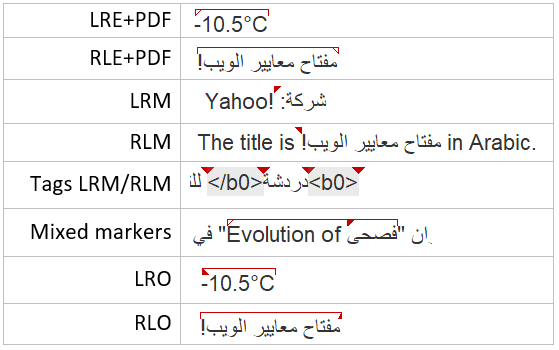

# OmegaT BidiMarkers

## Description

Improved BiDi markers. This is a fix for the [bug#988](https://sourceforge.net/p/omegat/bugs/988/).

## Installation

You can download the plugin jar file from the [release page](../../releases). The OmegaT plugin jar should be placed in `$HOME/.omegat/plugins` (Linux), `~/Library/Preferences/OmegaT/plugins/` (macOS), or `C:\Program Files\OmegaT\plugins` (Windows) depending on your operating system.

The option `View ‣ Mark Bidirectional Algorithm Control Characters` must be unchecked to avoid displaying the originals BiDi marks. 

## License

This project is distributed under the GNU general public license version 3 or later.

